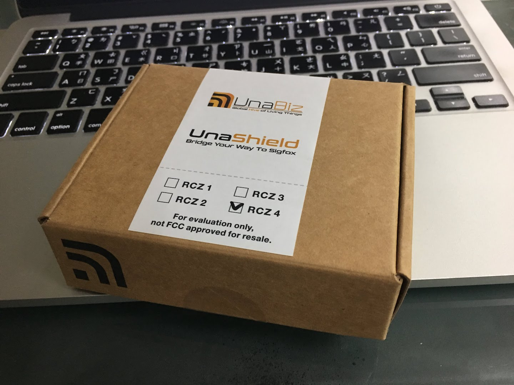
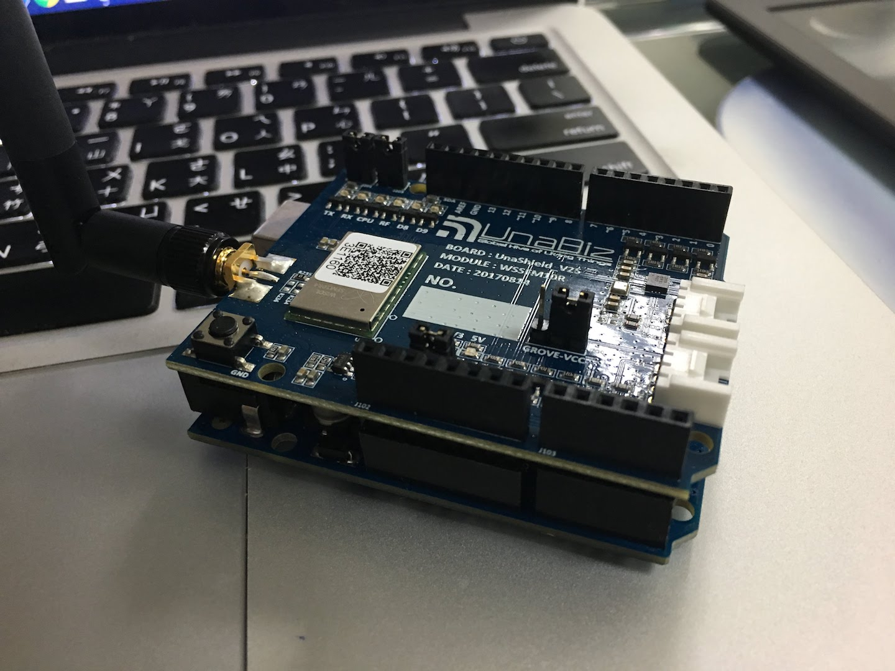
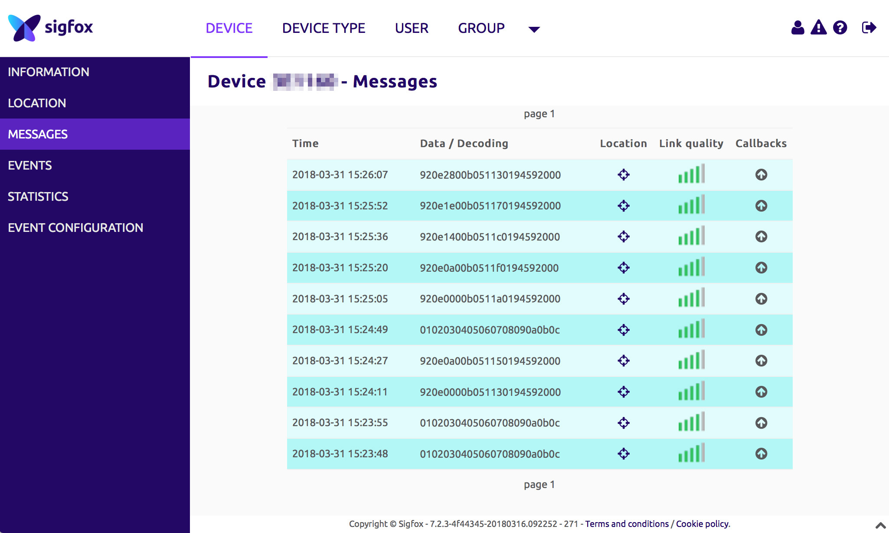
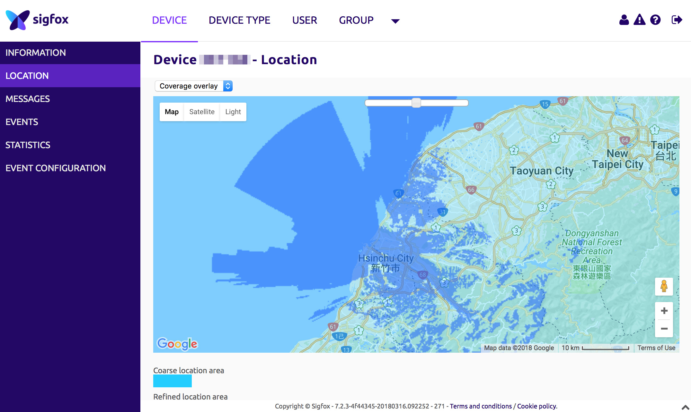

陽明交大智慧校園計畫 - Sigfox 開發平台

NYCU Smart Campus Project - Sigfox platform

Tech Contact: 優納比 UnaBiz 劉先生 0968692954
for NYCU Base Station & Dev kits

# UnaShield Setup

UnaBiz Taiwan sponsored NYCU with its Dev Kits (UnaShield) to support academic researches and applications with Sigfox.

Links:
* [UnaShield Documentation](https://unabiz.github.io/unashield/)
* [UnaShield Hardware Guide](https://unabiz.github.io/unashield/hardware.html)
* [Arduino library for connecting UnaShield to SIGFOX network](https://github.com/UnaBiz/unabiz-arduino) and [Activation](https://github.com/UnaBiz/unabiz-arduino/wiki/Activation)

## Unboxing

You should find your UnaShield in a carton box marked "RCZ4" (Radio Configurations Zone 4, where Taiwan is located). This is very important to recognize your RC Zone, as Sigfox uses different radio frequency in different zones.

<p align="center"></p>

## About UnaShield

After unboxing, attaching antenna to your UnaShield. Later on we'll attach it onto the Arduino board. The version of the shields we have is UnaShield V2S.

<p align="center"></p>

On UnaShield there are some sensors already built-in, so users may start collecting data in no time.

* NXP Accelerometer (G-sensor) - MMA8451Q
* BOSCH Temperature/Humidity/Pressure sensor - BME280

## Activation

Scan the QR code on the board using your mobile phone, you'll get the Sigfox **Device ID** and **PAC** (Porting Authorization Code). You should also find the same Device ID next to the QR code sticker.

Then, follow [the instructions from step 1 to 7 on this page](https://github.com/UnaBiz/unabiz-arduino/wiki/Activation) to activate your UnaShield.

Brief steps of the activation process:

1. Go to the [Dev Kit Activation](https://backend.sigfox.com/activate/Unabiz) page.
1. Pick your country: Find "Taiwan" and click on the UnaBiz icon.
1. Device information: Enter the Device ID and PAC you just got on your mobile phone.
1. Account details: Enter your personal information if it's your first time registering a device.
   * Check your mailbox for the activation email. Click the link in the message to complete the activation process.
   * Type your password twice.
1. You may now login to the [Backend Portal](http://backend.sigfox.com).

## Attach to Arduino

Please note that UnaShield works best with **Arduino Uno**. It is not compatible with all variants of Arduino boards due to different pin definitions.

<p align="center"></p>

UnaShield V2/V2S -- Arduino Uno pin mapping:

* Push-button &rarr; D6 Digital In
* Groove connector #1 &rarr; I2C Digital (SCL & SDA), or Analog In/Out (A4 & A5)
* Groove connector #2 &rarr; Analog In/Out (A2 & A3)
* User programmable Red LED &rarr; D9 Digital Out
* User programmable Green LED &rarr; D8 Digital Out

UnaShield sensor to Arduino I2C:

* Accelerometer (G-sensor) &rarr; I2C address 0x1C
* Temperature/Humidity/Pressure sensor &rarr; I2C address 0x76, Interrupt#1 & #2 (D2 & D3)

## Prepare Arduino IDE

In Arduino IDE, make sure you select the correct Arduino board and serial port. Set the serial data rate to 9600.

Download the [Arduino library for the UnaShield](https://github.com/UnaBiz/unabiz-arduino). Move the uncompressed folder to your Arduino libraries directory. Relaunch Arduino IDE and open the sample sketch: Examples &rarr; unabiz-arduino-master &rarr; DemoTestUnaShieldV2S.

In the settings of the transceiver object, make sure the variable `country` is set to `COUNTRY_TW`.

```c
static const String device = "g88pi"; // Device name if using emulator.
static const bool useEmulator = false; // Turn off emulator.
static const bool echo = true;
static const Country country = COUNTRY_TW; // Country code.
```

## Test Sigfox transceiver for the first time

Compile and upload the sketch to Arduino. You should get messages of the status of the UnaShield from the serial port (remember to set data rate to 9600).

The transceiver will broadcast Structured Messages every 10 seconds for 10 times. 10-second is the shortest interval between two Sigfox messages. So it's like sending data in burst-mode. This is only for testing the shield for the first time. Ideal settings for daily usage would be 10-15 minutes interval between messages.

If everything works without a hitch, you should see messages in your Backend Portal.

<p align="center"></p>

And also you can find the location information in which the coverage of the base station will be shown.

<p align="center"></p>
