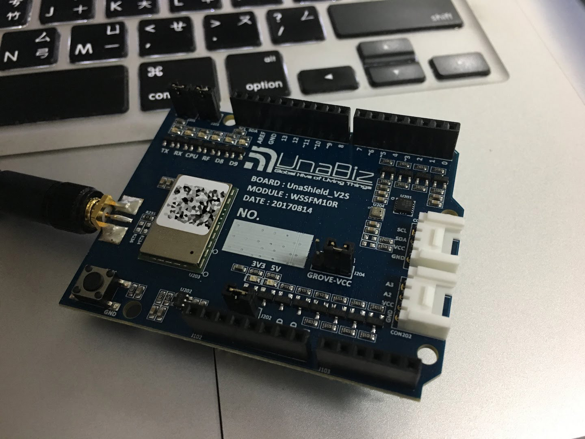

# NCTU Smart Campus - IoT - Sigfox

Links:
* UnaShield Documentation: https://unabiz.github.io/unashield/
* Arduino library for connecting UnaShield to SIGFOX network: https://github.com/UnaBiz/unabiz-arduino
  * Activation: https://github.com/UnaBiz/unabiz-arduino/wiki/Activation

## Setup

## Register UnaShield V2S

[fig] UnaBiz shield on Arduino Uno
